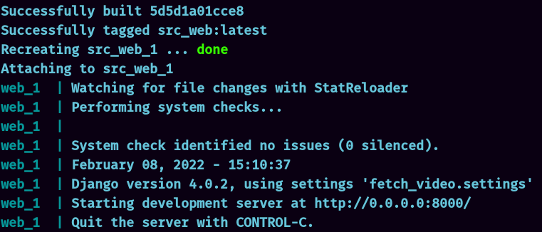

# Fetch Videos via Youtube v3 API

### Instructions to run this application

1. Clone the repository
2. `cd` into the `src/` directory
```shell
$ cd fetch-video-api/src/
```
3. build and run the container
```shell
$ docker-compose up --build
```

Now you should see this on the terminal 💻



This means we are good to go 💪🏻

4. Visit the website at http://127.0.0.1:8000/ and you should see my project there.


Please note,
* By default the dashboard page opens and you are seeing the latest fetched videos here.
* The chosen predefined search query is **news**.
* On this dashboard, you can search both via title and search bar, and this will run an index optimized query for this and return the list of matched videos
* You can click on these video cards and you will be redirected to the respective link on youtube
* For admin access, go to http://127.0.0.1:8000/admin
    * username: admin
    * password: admin 


# REST API Documentation

## Listing API : `GET`
**URL** :  http://127.0.0.1:8000/api/list

Sample Response: (paginated)
```json
{
    "count": 132,
    "next": "http://127.0.0.1:8000/api/list/?page=2",
    "previous": null,
    "results": [
        {
            "id": 123,
            "youtube_pk": "wUH3vp5oijQ",
            "title": "LIVE | TOM TV 3:00 PM MANIPURI NEWS, 08 FEB 2022",
            "description": "TOM TV 3:00 PM MANIPURI NEWS, 08 FEB 2022 NEWS ANCHOR: SINTHOI THOKCHOM #TOMTV #TOMTVManipuriNews ...",
            "pub_datetime": "2022-02-08T14:48:36+05:30",
            "thumbnail_default": "https://i.ytimg.com/vi/wUH3vp5oijQ/default_live.jpg",
            "thumbnail_medium": "https://i.ytimg.com/vi/wUH3vp5oijQ/mqdefault_live.jpg",
            "thumbnail_high": "https://i.ytimg.com/vi/wUH3vp5oijQ/hqdefault_live.jpg",
            "channel_title": "TOM TV"
        },
        ... and so on
    ]
}
```

## Basic Searching API : `GET`
**URL**: http://127.0.0.1:8000/api/search/

* You have to pass the 'title' and 'description' as query parameters to this API
* This API implements basic search feature, i.e. a video data will be returned only if its title and description exactly matches with the one in the query

Request: (Query params)
```
'title' : str
'description' : str
```
Response: (paginated)
```json
{
    "count": 3,
    "next": null,
    "previous": null,
    "results": [
        {
            "id": 123,
            "youtube_pk": "wUH3vp5oijQ",
            ...
        },
        ... and so on
    ]
}
```

## Add New Youtube API-KEY API  : `POST`
**URL**: http://127.0.0.1:8000/api/add_v3_key/

* The predefined API keys in the source code might exhaust their daily quota.
* You are supposed to use this API to insert new youtube v3 API keys to keep the application running

Request
```json
{
    "new_v3_key": "<a youtube v3 API key with unexhausted quota>"
}
```
Response: 
```
201 Created (if key gets added)
400 (if emtpy key)
500 (if exception)
```

## Optimized Searching API
**URL**: http://127.0.0.1:8000/api/optimal_search/


* You have to pass the 'title' and 'description' as query parameters to this API
* This API optimized search feature, it is optimized to break the search strings into pieces and search for each word in the database (partial text search)
* Datbase indexing on the important keys like title and description helps in achieving this

Request: (Query params)
```
'title' : str
'description' : str
```
Response: (paginated)
```json
{
    "count": 3,
    "next": null,
    "previous": null,
    "results": [
        {
            "id": 123,
            "youtube_pk": "wUH3vp5oijQ",
            ...
        },
        ... and so on
    ]
}
```


## Languages - Frameworks Used
* Django (Python)
* Django REST Framework
* HTML, CSS & Bootstrap for Frontend Dashboard
* Docker for containerization

Made with ❤️ by Animesh Kumar
